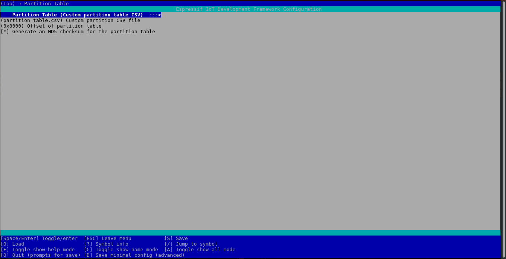
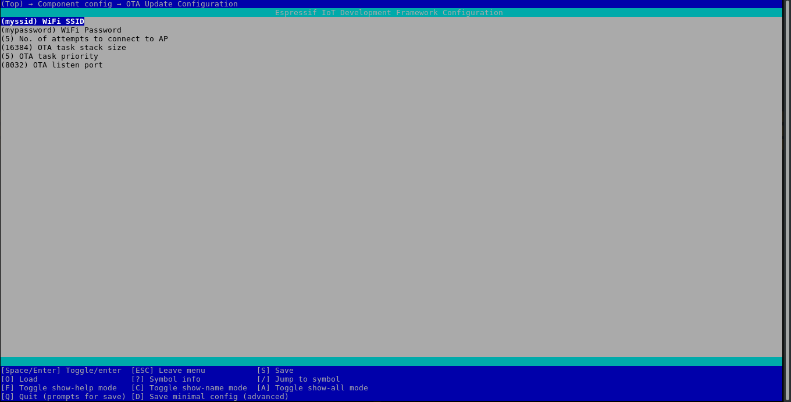

OTA_update_ESP32
=============

## About the Project

The project aims at enabling firmware update of ESP32 Over-The-Air using cURL from command-line. Testing was done with ESP32-DevKitC v4 board.

### Prerequisites

* **ESP-IDF v4.0.1 and above**

  You can visit the [ESP-IDF Programmming Guide](https://docs.espressif.com/projects/esp-idf/en/latest/get-started/index.html#installation-step-by-step) for the installation steps.

### Code

`/components` -> OTA Utils component

`/hello_world_example` -> OTA demo, using the [hello_world example](https://github.com/espressif/esp-idf/tree/release/v4.0/examples/get-started/hello_world)

`/python` -> **Experimental** Python3 script for broadcasting a binary to multiple ESP32 connected to the same network. Requires [python3-nmap](https://pypi.org/project/python3-nmap/).

## Integrate OTA capability to your project

1. Add the `components` directory to your project. You can also use CMakeLists.txt to source it as a common component to multiple projects.
   
2. Include the following code snippet to integrate OTA capability to your project. In your main/main.c - 
```c
// Including the OTA component
#include "ota_utils.h"
...

void app_main(void)
{
    // Initialising in STA Mode (Call this only when your project does not use / initialise WiFi)
    wifi_init_sta();
    // OTA Task
    xTaskCreate(ota_server_task, "ota_task", OTA_TASK_STACK_SIZE, NULL, OTA_TASK_PRIORITY, NULL);

    // Application code
    ...
}
```

3. Open the project configuration menu (`idf.py menuconfig`): 
   1. Go to `Partition Table` -> 
   
      1. Select `Factory app, two OTA definitions` for using predefined partition table
      2. Select `Custom partition table CSV` for using a custom partition table. You can use the one given in the `hello_world_example`; copy the `partition_table.csv` file in your project directory.

      <p align="center">
      <kbd></kbd>
      </p>
   
   2. Go to `Component config` → `OTA Update Configuration` -> 
   
      1. `WiFi SSID` / `WiFi Password`: Credentials of the WiFi network to which your machine is also connected to
      2. `OTA task stack size`: Allocate stack size for the OTA FreeRTOS task. Larger the stack, faster the OTA flashing. But, risk of memory overflow increases. The stack size should be in accordance with all the other components your project is using. (E.g. UART, MQTT, etc.)
      3. `OTA task priority`: Assign a priority to the OTA FreeRTOS task. Always keep it greater than your application tasks.
      4. `OTA listen port`: Listening socket port for OTA

      <p align="center">
      <kbd></kbd>
      </p>
   
4. Compile and burn the firmware `idf.py -p PORT -b BAUD flash`. Run `idf.py -p PORT monitor` and note down the IP assigned to your ESP module. The default OTA listen port is 8032.
   
5. Now, whenever you want to update the firmware, fire up a new terminal and enter the following command:
   
   `curl -v 192.168.43.177:8032 --data-binary @- < build/hello_world.bin`

   * Example Output:
   ```shell
    I (4935) wifi_utils: IP Address:192.168.43.177
    I (4935) wifi_utils: Connected to AP: SSID - myssid Password - mypassword
    This is ESP32 chip with 2 CPU cores, WiFi/BT/BLE, silicon revision 1, 4MB external flash
    D (4945) : ota_utils -> (init_tcp_server:51) Server Socket: Port - 8032
    Hello world!
    Hello world!
    Hello world!
    I (7325) : ota_utils -> (init_tcp_server:99) TCP Connection Established
    D (7325) : ota_utils -> (ota_server_task:162) Socket ID: 55
    D (7325) : ota_utils -> (ota_server_task:165) Writing to partition subtype 16 at offset 0x110000
    D (7335) : ota_utils -> (receive_data:118) Received Header Packet
    D (7345) : ota_utils -> (receive_data:123) Detected content length: 635648
    Hello world!
    Hello world!
    Hello world!
    Hello world!
    Hello world!
    Hello world!
    Hello world!
    Hello world!
    Hello world!
    Hello world!
    Hello world!
    Hello world!
    Hello world!
    D (21435) : ota_utils -> (receive_data:149) OTA Transferred Finished: 635648 bytes
    Hello world!
    D (23005) : ota_utils -> (ota_server_task:177) Next Boot Partition Subtype 16 At Offset 0x110000
    ```

6. Voila! Your ESP32 is now running the code you uploaded Over-the-Air!

## Troubleshooting

* Verify your WiFi SSID, password, IP Address and port.
* Check whether your machine is connected to the same AP as that of ESP32.
* Check the heap available by using the [Heap Memory Debugging](https://docs.espressif.com/projects/esp-idf/en/latest/esp32/api-reference/system/heap_debug.html) API for memory overflows and reduce the OTA task stack size accordingly.
* For any other bugs or errors, you can always raise [issues](https://github.com/laukik-hase/OTA_update_ESP32/issues).

## Future Work

1. Suspending or deleting all the applications tasks when OTA update is triggered.
2. Modification for projects where ESP32 needs to act as an AP.
3. Testing with advanced projects with multiple components enabled (E.g, UART, MQTT, etc)

## Acknowledgements

* GitHub Project: [ESP32-OTA-Commandline](https://github.com/versamodule/ESP32-OTA-Commandline) by [versamodule](https://github.com/versamodule) -> [License](https://github.com/versamodule/ESP32-OTA-Commandline/issues/1)

* [ESP-IDF Examples - Native OTA](https://github.com/espressif/esp-idf/tree/release/v4.0/examples/system/ota/native_ota_example)
